# 🏦 Alke Wallet - Database System Design
**Desarrollador:** Francisco Carrasco Gálvez (@fraan_cgz)

---

## 1. Definición de Estructura (DDL)
Se definen las tablas con restricciones de integridad y tipos de datos precisos.

📊 Table: app_user
```sql
create table app_user(
    user_id serial primary key,
    name varchar(100) not null,
    email varchar unique constraint valid_user check (length(email) > 5),
    password varchar not null,
    current_balance numeric(15,2) default 0 constraint positive_balance check (current_balance >= 0)
);
```

💱 Table: currency
```sql
create table currency(
currency_id serial primary key,
currency_name varchar(30) not null,
currency_symbol varchar(10) not null
);
```

💸 Table: transaction
```sql
create table transaction(
transaction_id serial primary key,
amount numeric(15,2) not null default 0 constraint positive_amount check (amount >= 0),
transaction_date TIMESTAMP not null default current_timestamp,
sender_user_id int not null,
receiver_user_id int not null,
currency_id int not null,
foreign key (sender_user_id) references app_user(user_id),
foreign key (receiver_user_id) references app_user(user_id),
foreign key (currency_id) references currency(currency_id)
);
```

---

## 2. Optimización e Índices
Implementación de índices para mejorar el rendimiento de búsqueda en transacciones.

```sql
create index idx_sender_user_id on transaction(sender_user_id);
create index idx_sender_date on transaction(sender_user_id, transaction_date);
```

---

## 3. Carga de Datos (DML)
Poblamiento inicial de usuarios, divisas y transacciones.

```sql
INSERT INTO currency (currency_name, currency_symbol) VALUES 
('Peso Chileno', 'CLP'), -- Moneda base para tus pruebas en Buin
('Dólar Estadounidense', 'USD'), -- Para probar transacciones internacionales
('Euro', 'EUR'); -- Para verificar que el sistema soporta múltiples divisas
```

```sql
INSERT INTO app_user (name, email, password, current_balance) VALUES 
('Francisco González', 'fraan_cgz@example.com', 'pass123', 850000.50), 
('Javier Iturra', 'j.iturra@example.com', 'secure456', 120000.00),
('Ignacia Silva', 'isi@example.com', 'valida789', 450000.00),
('Erick González', 'erick.g@example.com', 'bro789', 950000.00),    
('Valentina Paz', 'valepaz@example.com', 'paz123', 320000.75),
('Andrés Castro', 'acastro@example.com', 'andres456', 15000.00),
('Camila Soto', 'csoto@example.com', 'cami789', 670000.20),
('Roberto Muñoz', 'rmunoz@example.com', 'rob123', 0.00),
('Elena Rivas', 'erivas@example.com', 'elena456', 1100000.00),    
('Mauricio Vera', 'mvera@example.com', 'mau789', 540000.10);
```

```sql
INSERT INTO transaction (sender_user_id, receiver_user_id, amount, currency_id, transaction_date) VALUES 
(1, 4, 12000.00, 1, '2026-03-01 08:30:00'), -- Francisco -> Erick (CLP)
(4, 9, 50.00, 2, '2026-03-01 10:15:00'),    -- Erick -> Elena (USD)
(9, 10, 3500.00, 1, '2026-03-01 12:45:00'),   -- Elena -> Mauricio (CLP)
(10, 3, 10.00, 3, '2026-03-02 09:20:00'),    -- Mauricio -> Ignacia (EUR)
(2, 5, 8000.00, 1, '2026-03-02 14:10:00'),    -- Javier -> Valentina (CLP)
(5, 6, 5.50, 2, '2026-03-02 18:30:00'),      -- Valentina -> Andrés (USD)
(7, 2, 25000.00, 1, '2026-03-03 07:45:00'),  -- Camila -> Javier (CLP)
(8, 7, 100.00, 2, '2026-03-03 11:00:00'),    -- Roberto -> Camila (USD)
(9, 1, 15.00, 3, '2026-03-03 15:30:00'),     -- Elena -> Francisco (EUR)
(6, 8, 4000.00, 1, '2026-03-04 10:00:00'),    -- Andrés -> Roberto (CLP)
(1, 10, 12.00, 2, '2026-03-04 13:20:00'),    -- Francisco -> Mauricio (USD)
(3, 7, 9000.00, 1, '2026-03-04 16:45:00'),    -- Ignacia -> Camila (CLP)
(4, 2, 20.00, 3, '2026-03-05 08:15:00'),     -- Erick -> Javier (EUR)
(5, 9, 15000.00, 1, '2026-03-05 12:00:00'),  -- Valentina -> Elena (CLP)
(10, 5, 2.00, 2, '2026-03-05 19:30:00'),     -- Mauricio -> Valentina (USD)
(7, 4, 3000.00, 1, '2026-03-06 09:10:00'),    -- Camila -> Erick (CLP)
(2, 6, 5.00, 3, '2026-03-06 14:50:00'),      -- Javier -> Andrés (EUR)
(8, 1, 1000.00, 1, '2026-03-06 17:05:00'),    -- Roberto -> Francisco (CLP)
(6, 3, 45.00, 2, '2026-03-07 11:25:00'),     -- Andrés -> Ignacia (USD)
(4, 10, 2200.00, 1, '2026-03-07 20:00:00');   -- Erick -> Mauricio (CLP)
```
> **Visualización de datos insertados:**
---
> 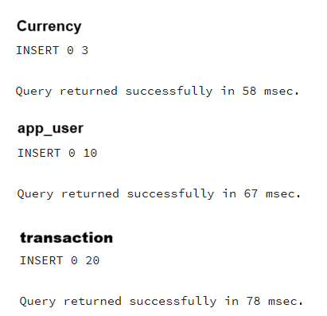

Currency
> 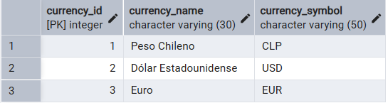

app_user
> 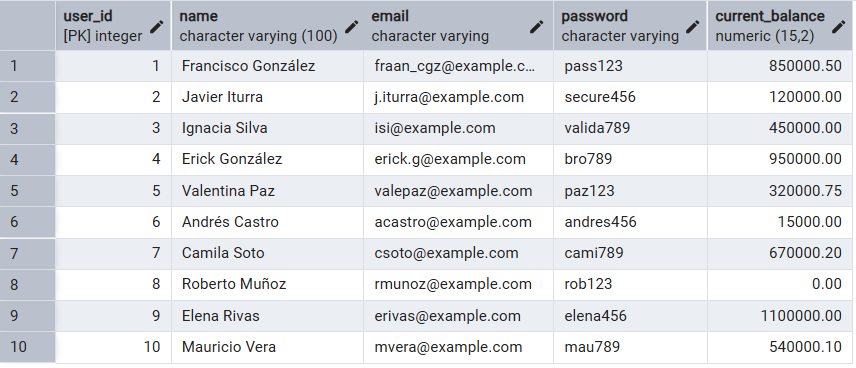

transaction
> 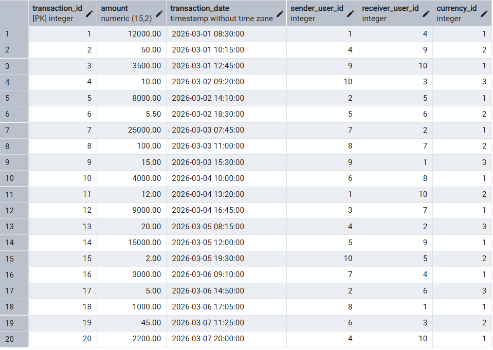

---

## 4. Consultas y Reportabilidad
Generación de reportes de transacciones y vistas de saldos.

4.1 Obtener el nombre de la moneda elegida por un usuario específico.
```sql
select u.name, c.currency_name from transaction t
join app_user u
on t.sender_user_id = u.user_id
join currency c
on c.currency_id = t.currency_id
where u.user_id = 1
order by  c.currency_name;
```
> **Resultado :**
> 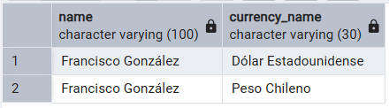

4.2  Todas las transacciones registradas. 
```sql
select 
	transaction_id as "N° Transacción",
	u_sender.name as "Enviado por",
	transaction_date as Fecha, 
	u_receiver.name as "Recibido por",
	amount as Monto,
	currency_symbol as Divisa
from transaction t
join app_user u_sender
on u_sender.user_id = t.sender_user_id
join app_user u_receiver
on u_receiver.user_id = t.receiver_user_id
join currency c
on c.currency_id = t.currency_id
order by t.transaction_id;
```
> **Resultado :**
> 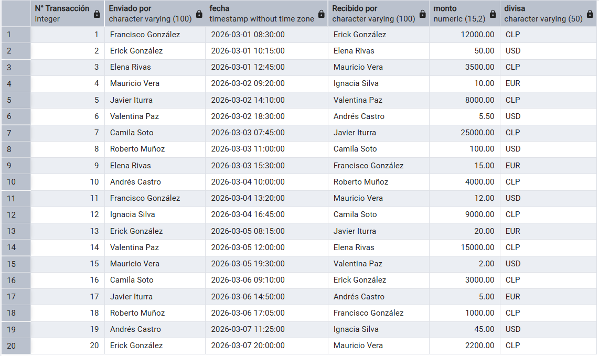

4.3  Transacciones realizadas por un usuario específico
```sql
select 
	transaction_id as "N° Transacción",
	u_sender.name as "Enviado por",
	transaction_date as Fecha, 
	u_receiver.name as "Recibido por",
	amount as Monto,
	currency_symbol as Divisa
from transaction t
join app_user u_sender
on u_sender.user_id = t.sender_user_id
join app_user u_receiver
on u_receiver.user_id = t.receiver_user_id
join currency c
on c.currency_id = t.currency_id
where u_sender.user_id = 1
order by t.transaction_date desc;
```
> **Resultado :**
> 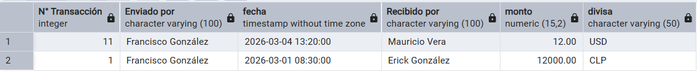

4.4 Modificar el campo correo electrónico de un usuario específico 
```sql
update app_user 
set email = 'f.gonzalez@alkemy.com'
where user_id = 1;
```
> **Resultado :**
> 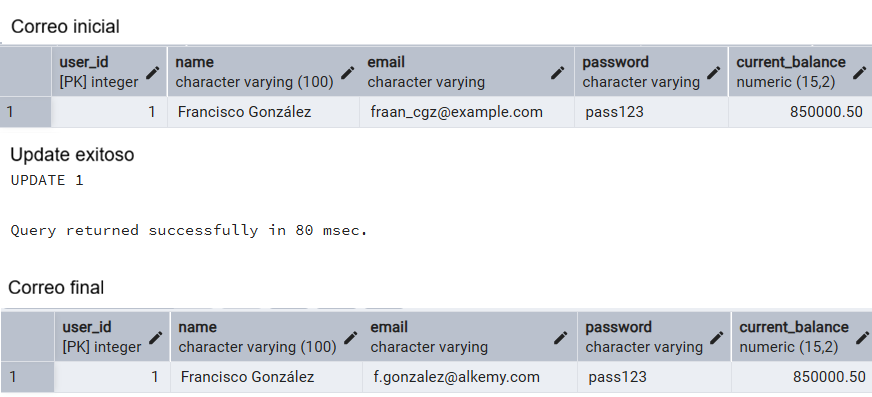

4.5 Eliminar los datos de una transacción 
```sql
delete 
from transaction
where transaction_id = 1;
```
> **Resultado :**
> 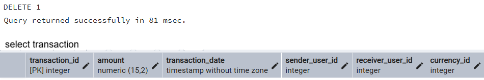


4.6 Practicar sub‑consultas para obtener el total de transacciones por usuario  
```sql
select count(*) as "Total_transacciones_por_usuario"
from transaction
where sender_user_id in (select user_id from app_user where user_id = 1)
or receiver_user_id in (select user_id from app_user where user_id = 1);
```
> **Resultado :**
---
> 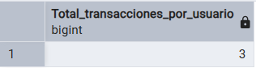


4.7 Vista que muestre el top‑5 de usuarios con mayor saldo.
```sql
create or replace view v_top_five_user_balance as
select name, current_balance
from app_user
order by current_balance desc
limit 5;

select * from v_top_five_user_balance;
```
> **Resultado :**
---
> 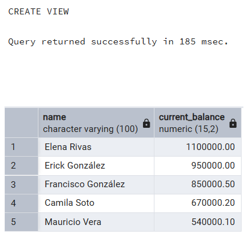

---

## 5. Transacción Atómica (Safety Flow)
Prueba de consistencia: transferencia de fondos entre usuarios.

```sql
start TRANSACTION;
    update app_user set current_balance = current_balance - 100000 where user_id = 1;
    update app_user set current_balance = current_balance + 100000 where user_id = 6;
    insert into transaction (sender_user_id, receiver_user_id, amount, currency_id)
    values(1, 6, 100000, 1);
COMMIT;
```
> **Saldos después de la transferencia:**
---
> 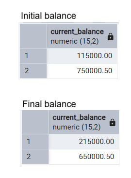


---

## 6. Manejo de Errores e Integridad
Simulación de error de llave foránea (usuario inexistente) y uso de `ROLLBACK`.

```sql
start TRANSACTION;
    -- Intento de envío a ID 550 (No existe)
    insert into transaction (sender_user_id, receiver_user_id, amount, currency_id)
    values(1, 550, 3500, 1);
ROLLBACK;
```
> **Mensaje de error del motor:**
---
> 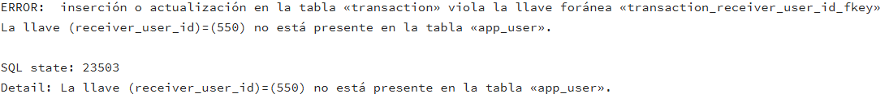
> **Estado tras Rollback:**
---
> 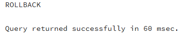

---